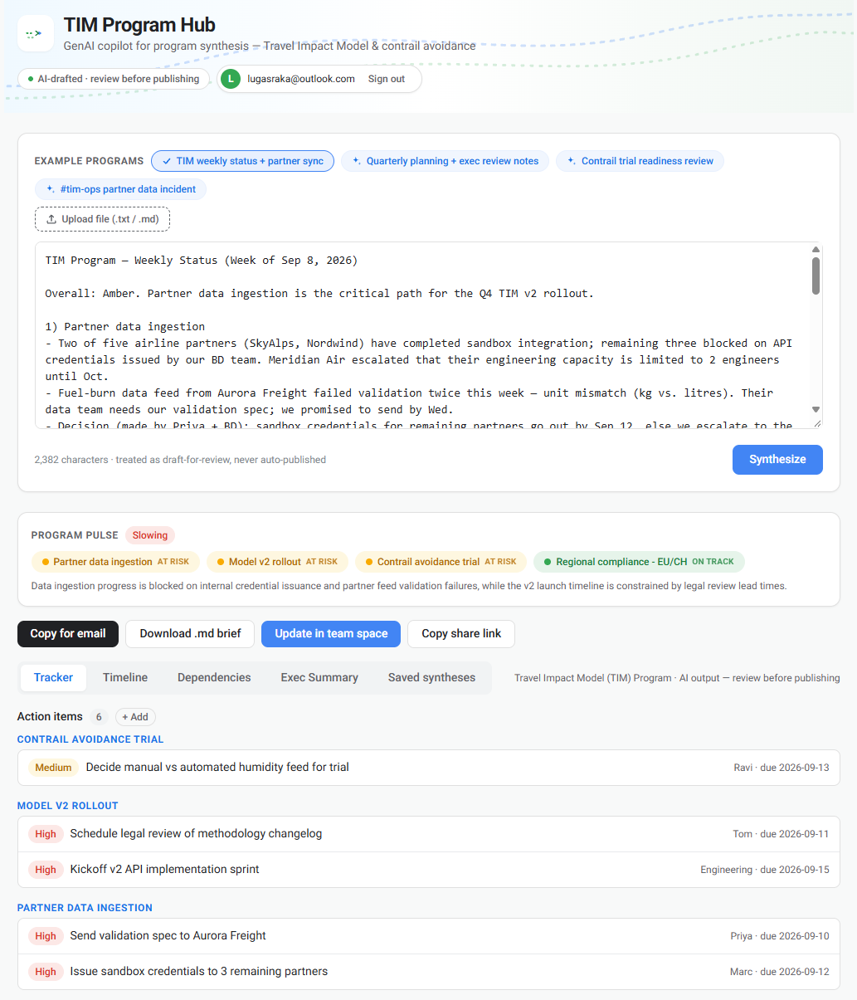

# TIM Program Hub

A program management tool for Google Search Sustainable Journeys (Travel Impact Model, contrail avoidance, and Search sustainability). It takes unstructured updates (meeting notes, status docs, and chat logs) and extracts structured decisions, action items, risks, dependencies, and leadership briefs.

**Live Demo:** [https://program-tracker-gen-ai.vercel.app/](https://program-tracker-gen-ai.vercel.app/)



## Features

- **Program pulse:** RAG status and momentum by workstream
- **Tracker:** Decisions, action items (with owner, due date, and priority), risks with mitigations, cross-team dependencies, and open questions
- **Timeline:** Milestone swimlanes by workstream, with undated items tracked in a TBD lane
- **Dependency flow:** Visual mapping of upstream blockers and blocked items
- **Executive summary:** One-sentence headline, workstream statuses, and concrete asks
- **Export options:** Rich text copy for email (Gmail, Outlook, Docs) and Markdown file export
- **Inline editing:** Click any extracted field to edit it inline; change priorities and statuses via dropdowns; hand-edited items carry an edited tag
- **Sample scenarios:** Built-in test inputs including weekly updates, quarterly planning, trial reviews, and incident threads
- **Team sharing (optional):** Sign in with a magic link, save syntheses to a shared workspace, open and edit them as a team via share links

### Extraction rules

- Output is strictly constrained to a typed JSON schema using Gemini structured output.
- Missing owners, dates, or risks default to `TBD` rather than hallucinated values.
- Results are saved to browser `localStorage` and treated as review drafts.

## Getting started

1. Get an API key from [Google AI Studio](https://aistudio.google.com/apikey).
2. Create `.env.local` from the template and add your key:
   ```bash
   cp .env.local.example .env.local
   ```
3. Install dependencies and start the development server:
   ```bash
   npm install
   npm run dev
   ```
4. Open [http://localhost:3000](http://localhost:3000), choose a sample scenario or paste your own notes, and click **Synthesize**.

## Team sharing (optional)

Syntheses can be saved to a shared workspace so teammates can open, edit, and re-save them. The backend is a free [Supabase](https://supabase.com) project (Postgres + magic-link auth + row-level security):

1. Create a Supabase project and run `supabase/migration.sql` in its SQL editor. The script is idempotent—safe to re-run after updates.
2. Add `NEXT_PUBLIC_SUPABASE_URL` and `NEXT_PUBLIC_SUPABASE_ANON_KEY` to `.env.local` (Project Settings → API).
3. Restart the dev server — a sign-in button, **Save to team**, **Copy share link**, and a **Saved syntheses** tab appear.

Any signed-in teammate can see and edit all saved syntheses (last-write-wins); only the author can delete their own. Share links use `/?s=<id>`. Without the Supabase variables, the sharing UI hides and the app behaves as before.

## Tech stack

- **Framework:** Next.js 14 (App Router), TypeScript, Tailwind CSS
- **Model:** Gemini (`gemini-3.6-flash`) with structured JSON schema output
- **Storage:** Browser `localStorage` (no database required); optional Supabase (Postgres + Auth + RLS) for team sharing
- **Deployment:** Vercel. Push to GitHub, import the repo, and set `GEMINI_API_KEY`, `NEXT_PUBLIC_SUPABASE_URL`, and `NEXT_PUBLIC_SUPABASE_ANON_KEY` as environment variables.

## Planned improvements

- Sync action items directly to Google Sheets or GitHub Issues
- Multi-document delta tracking (compare against prior syntheses)
